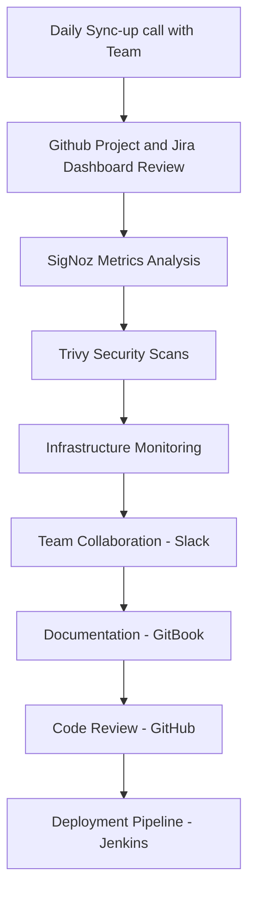

<div align="center">
  
</div>


<p align="left"> 
  
  
  
  
  
</p>

## 🚀 Professional Summary

```yaml
name: Deepak Nemade (DN)
role: Network and System | Cloud and DevOps Engineer
company: Ayanworks Technology Solutions Pvt. Ltd.
location: India
experience: 5 years
github_accounts:
  - work: "https://github.com/deepaknemad"
  - personal: "https://github.com/DeepDN"
specialization: 
  - AWS Cloud Architecture
  - Infrastructure as Code
  - CI/CD Pipeline Design
  - Container Orchestration
  - Network Security
current_focus: 
  - Advanced Kubernetes
  - Terraform Modules
  - AWS Security Best Practices
```

- 🔭 **Currently Working:** Lead DevOps Engineer at [CREDEBL](https://www.credebl.id/) - Building scalable identity solutions
- 🌟 **Open Source Contributor:** Working on [CREDEBL](https://github.com/credebl/platform) - Digital Identity Platform
- 🌱 **Learning:** Advanced Kubernetes, Terraform, and AWS Security
- 📝 **Content Creator:** Regular contributor on [LinkedIn](https://www.linkedin.com/in/deepak-nemade/) sharing DevOps insights
- 💬 **Expertise:** AWS Cloud Architecture, CI/CD Pipelines, Infrastructure as Code, Network Security
- 📫 **Contact:** deepak.nemade@ayanworks.com
- 👨‍💻 **Personal GitHub:** [DeepDN](https://github.com/DeepDN)


## 🎮 Interactive Zone

<div align="center">

### 🐍 Snake Game - Watch it eat my contributions!


### 🎯 Waka Time Stats
<!--START_SECTION:waka-->
<!--END_SECTION:waka-->

</div>

## 🛠️ Technology Stack & Daily Tools

<div align="center">

### ☁️ Cloud Platforms & Infrastructure


<!--  -->

### 🔧 DevOps & Orchestration


<!--  -->

### 📊 Monitoring & Observability


### 🛡️ Security & Compliance


### 💻 Programming & Scripting


<!--  -->

### 🗄️ Databases & Caching


### 📧 Communication & Email Services


### 📚 Documentation & Content Management


### 🎨 Design & Creative Tools


### 🌐 Domain & Hosting Services


### 🔧 Development & Terminal Tools


### 📊 Project Management & HR


### 🤖 AI & Automation Tools


### 🏅 Certifications & Standards


</div>

## 📊 GitHub Analytics Dashboard

<div align="center">
   
  
</div>

<div align="center">
  
</div>

## 🏆 Achievements & Trophies

<div align="center">
  
</div>

## 📈 Contribution Activity

<div align="center">
  
</div>

## 💼 Professional Experience & Daily Operations

<table>
<tr>
<td width="50%">

### 🎯 Key Metrics
- **Cloud Migrations:** 50+ applications
- **Cost Reduction:** 40% infrastructure savings
- **Deployment Speed:** 80% faster with CI/CD
- **Uptime Achievement:** 99.9% SLA
- **Team Size:**  50+ engineers
- **Security Scans:** Daily Trivy & Wazuh monitoring

</td>
<td width="50%">

### 🏅 Certifications & Expertise
- ☁️ AWS Solutions Architect
- 🔧 Kubernetes Administrator (CKA)
- 🛡️ AWS Security Specialist
- 📊 Terraform Associate
- 🚀 DevOps Foundation
- 🔐 Security Operations (Wazuh/SigNoz)

</td>
</tr>
</table>

## 🔧 Daily Workflow & Tools Integration



## 🌐 Connect & Collaborate

<div align="center">

[](https://linkedin.com/in/deepak-nemade)
[](https://hashnode.com/@deepakdn)
[](mailto:deepak.nemade@ayanworks.com)
[](https://github.com/DeepDN)

</div>

## 💡 Latest Blog Posts & Insights

<!-- BLOG-POST-LIST:START -->
- 🚀 Building Scalable Microservices with Kubernetes
- ☁️ AWS Cost Optimization Strategies for Startups
- 🔧 Infrastructure as Code Best Practices
- 🛡️ Security-First DevOps Implementation
- 📊 SigNoz vs Traditional Monitoring Solutions
<!-- BLOG-POST-LIST:END -->

---

<div align="center">
  
</div>

<div align="center">
  
**"Automating today for a better tomorrow"** 🚀

*Building resilient, scalable, and secure cloud infrastructure*

</div>


